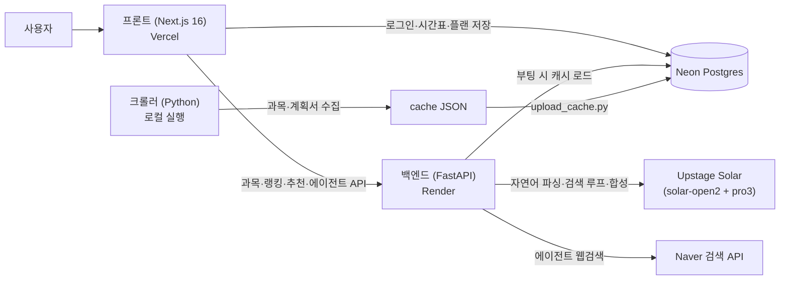

# SyllaFit — 시간표 짜기, 딸깍 한 번으로

> 인하대생을 위한 AI 수강 플래닝 서비스. 강의계획서를 AI가 대신 읽고 팀플·과제·평가 기준으로 시간표를 짜주며, 학교생활 에이전트가 웹을 검색해 공모전·자격증·행사까지 브리핑해 준다.

**Live**: https://sylla-fit.vercel.app

시간표 앱은 많지만, **같은 과목이라도 분반(교수)마다 팀플 유무·과제량·평가방식이 다르다**는 건 강의계획서를 열어봐야만 알 수 있다. SyllaFit은 2026-2학기 **전체 분반 2,927개**와 **강의계획서 2,253건**을 수집·분석해 그 차이를 시간표 추천에 반영한다.

---

## 주요 기능

| 기능 | 설명 |
|---|---|
| **AI 시간표** | 들을 과목만 담고 선호를 한 문장으로("오전 피하고 팀플 적게") → AI가 계획서를 근거로 분반까지 골라 시간표 3안+ 추천 |
| **내가 짜는 시간표** | 검색해서 바로 추가(시간 겹침 자동 차단), 과목별 계획서 근거 확인, "화요일에 들을 교양 뭐 있어?" 같은 **AI 검토** 질문 |
| **실패 대비 시간표** | 수강신청에 실패할 것 같은 과목을 체크하면, 그 과목만 **같은 과목 다른 분반**으로 바꾼 완성 시간표를 여러 안 생성 |
| **학교생활 에이전트** (Beta) | 학과·학년·목표·시간표를 주면 에이전트가 **실시간 웹검색**으로 공모전·행사·자격증·커리큘럼·면접 대비를 한 번에 브리핑. 마음에 든 항목은 "내 플랜"에 저장해 상태(예정/진행/완료)로 관리 |
| **저장·동기화** | 인하대 구글 계정(@inha.edu) 로그인 시 시간표·보관함·플랜이 DB에 저장되어 어느 기기서든 복원 (열람·시간표 작성은 로그인 없이 가능) |

## 신뢰성 원칙 — 근거 없으면 말하지 않는다

AI가 학생에게 잘못된 정보를 주면 수강신청을 망친다. 그래서:

- **모든 추출값은 계획서 원문 인용(근거)과 함께** 저장되고, 화면에도 근거가 같이 표시된다.
- **근거 검증 패스(M5)**: 추출된 주장 9,642건을 Solar로 재판정해 근거가 지지하지 않는 주장 **445건을 철회**(지지율 89.4%). 확신 없는 값은 `null`로 강등된다.
- 팀플 여부는 `있음/모름`만 판정한다 — "없음"은 부재 증명이 불가능하므로 단정하지 않는다.
- 계획서 미제출 분반은 "정보 없음"이 아니라 **"아직 계획서가 제출되지 않았어요"** 로 구분 표기한다.
- 점수·순위·충돌 검사는 전부 **결정론 코드**다. 같은 입력이면 항상 같은 결과가 나온다. LLM은 자연어 이해(선호 파싱·추천 사유)에만 쓴다.
- 에이전트 추천도 같은 원칙: **실제 검색 결과에 없는 출처를 인용한 항목은 코드가 폐기**하고, 마감이 확실히 지난 일정은 걸러내며(프롬프트+날짜 파싱 이중 가드), 날짜는 출처 원문 그대로 "출처 확인" 라벨과 함께 보여준다.

## 아키텍처



- **하이브리드 설계**: 시간 충돌·조합 생성·점수·랭킹 = 결정론(Python), 자연어 선호 해석·과목 추천·Q&A = Solar. LLM 호출을 최소화해 응답은 보통 2~4초.
- **캐시 파이프라인**: 크롤러가 수강신청 사이트에서 전 분반(시간·강의실·이수구분)과 강의계획서를 수집 → 구조화(α 추출 + M5 검증) → JSON 캐시. 개인정보·저작물 재배포를 피하기 위해 **캐시는 저장소에 커밋하지 않고** Neon에 보관하며, 배포 백엔드가 부팅 시 내려받는다.
- **Solar 운용 노트**: `solar-open2`는 추론(reasoning) 모델이라 기본 설정으로는 호출당 20~55초가 걸린다. `reasoning_effort: "minimal"`로 추론을 끄면 **2초대**로 동작하며 파싱 품질은 동일했다(실측).
- **에이전트 = 모델 믹스**: 학교생활 에이전트는 클로드식 검색 루프의 미니어처다 — Solar가 function calling으로 `web_search` 도구(Naver)를 스스로 병렬 호출(최대 3라운드)하고, 수집된 근거만으로 브리핑을 합성한다. 검색 판단은 `solar-open2`, 대량 JSON 합성은 서빙이 빠른 `solar-pro3`로 역할을 나눠 실행 시간을 139초→52초로 줄였다(실측).

## 저장소 구조

```
frontend/   Next.js 16 (App Router) — 랜딩, 도구, 관리자, Auth.js(Google), Neon 연동
backend/    FastAPI — 과목/랭킹/추천/폴백 API, Solar 클라이언트, 캐시 부트스트랩
crawler/    Python — 전 분반·강의계획서 수집, 캐시 빌드 (로컬에서 실행)
```

## 로컬 실행

```bash
# 1) 백엔드  (Python 3.13+)
cd backend
pip install -r requirements.txt
cp .env.example .env          # SOLAR_API_KEY 등 채우기
python -m uvicorn app.main:app --port 8000

# 2) 프론트  (Node 20+)
cd frontend
npm install
cp .env.example .env.local    # Google OAuth·DB 등 채우기 (없어도 조회 기능은 동작)
npm run dev                   # http://localhost:3000
```

- 과목 데이터가 필요하다: `crawler/`로 직접 수집하거나(`crawl_list.py` → `crawl_all.py` → `build_cache.py`), 이미 업로드된 Neon 캐시가 있다면 백엔드가 부팅 시 자동으로 내려받는다(`DATABASE_URL` 필요).
- 크롤러는 요청 간 1초 지연·재시도·체크포인트를 지키며, 공개된 강의계획서 조회 페이지만 사용한다.
- 학교생활 에이전트를 쓰려면 `NAVER_CLIENT_ID/SECRET`(네이버 검색 API)이 추가로 필요하다 — 없어도 시간표 기능은 전부 동작한다.

## 기술 스택

| 영역 | 스택 |
|---|---|
| 프론트 | Next.js 16, React 19, TypeScript, Auth.js v5 (Google OAuth, @inha.edu 제한), Vercel Analytics |
| 백엔드 | FastAPI, httpx, Uvicorn, gzip 압축 응답 |
| AI | Upstage Solar — `solar-open2`(선호 파싱·에이전트 검색 루프, function calling) + `solar-pro3`(브리핑 합성), JSON mode |
| 검색 | Naver 검색 API (웹문서·뉴스·블로그 — 에이전트 web_search 도구) |
| 데이터 | Neon Postgres (유저 시간표·플랜·에이전트 세션·공지·행동 이벤트·캐시 blob) |
| 배포 | Vercel (프론트) + Render (백엔드), GitHub 연동 자동 배포 |

## 면책

- 모든 정보는 인하대학교가 공개한 강의계획서·강의시간표 기준이며, 실제 강의 운영과 다를 수 있다.
- AI 분석 결과는 참고용이다. **최종 수강신청은 반드시 학교 포털에서 확인**할 것.
- 본 서비스는 인하대학교 공식 서비스가 아니며, 어떤 기관과도 제휴 관계가 없다.

문의: gitue11@gmail.com · [이용약관](https://sylla-fit.vercel.app/terms) · [개인정보처리방침](https://sylla-fit.vercel.app/privacy)
