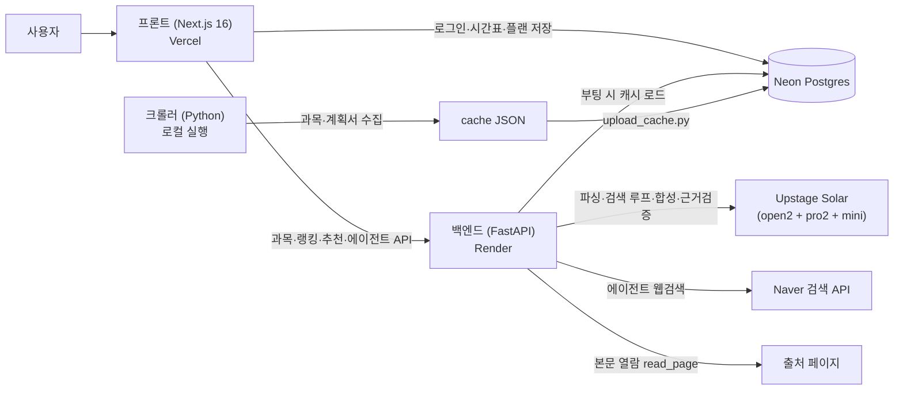

# SyllaFit — 시간표 짜기, 딸깍 한 번으로

> 인하대생을 위한 AI 수강 플래닝 서비스. 강의계획서를 AI가 대신 읽고 팀플·과제·평가 기준으로 시간표를 짜주며, 학교생활 에이전트가 웹을 검색해 공모전·자격증·행사까지 브리핑해 준다.

**Live**: https://sylla-fit.vercel.app

시간표 앱은 많지만, **같은 과목이라도 분반(교수)마다 팀플 유무·과제량·평가방식이 다르다**는 건 강의계획서를 열어봐야만 알 수 있다. SyllaFit은 2026-2학기 **전체 분반 2,927개**와 **강의계획서 2,253건**을 수집·분석해 그 차이를 시간표 추천에 반영한다.

---

## 주요 기능

| 기능 | 설명 |
|---|---|
| **AI 시간표** | 들을 과목만 담고 선호를 한 문장으로("오전 피하고 팀플 적게") → AI가 계획서를 근거로 분반까지 골라 시간표 3안+ 추천 |
| **내가 짜는 시간표** | 검색해서 바로 추가(시간 겹침 자동 차단), 과목별 계획서 근거 확인, "화요일에 들을 교양 뭐 있어?" 같은 **AI 검토** 질문 |
| **실패 대비 시간표** | 수강신청에 실패할 것 같은 과목을 체크하면, 그 과목만 **같은 과목 다른 분반**으로 바꾼 완성 시간표를 여러 안 생성 |
| **학교생활 에이전트** (Beta) | 학과·학년·목표·시간표를 주면 에이전트가 **실시간 웹검색**으로 공모전·행사·자격증·커리큘럼·면접 대비를 한 번에 브리핑(약 20초). 마감일이 스니펫에 없으면 **출처 페이지 본문까지 읽어** 확인하고, 결과에 빈 카테고리가 있으면 **스스로 다시 검색**해 채운다. 출처와 대조 검증된 항목엔 `✓ 출처 확인됨` 배지, 마감이 있으면 `D-7` 표시. 마음에 든 항목은 "내 플랜"에 저장해 **마감 임박순**으로 상태(예정/진행/완료) 관리 |
| **저장·동기화** | 인하대 구글 계정(@inha.edu) 로그인 시 시간표·보관함·플랜이 DB에 저장되어 어느 기기서든 복원 (열람·시간표 작성은 로그인 없이 가능) |

## 신뢰성 원칙 — 근거 없으면 말하지 않는다

AI가 학생에게 잘못된 정보를 주면 수강신청을 망친다. 그래서:

- **모든 추출값은 계획서 원문 인용(근거)과 함께** 저장되고, 화면에도 근거가 같이 표시된다.
- **근거 검증 패스(M5)**: 추출된 주장 9,642건을 Solar로 재판정해 근거가 지지하지 않는 주장 **445건을 철회**(지지율 89.4%). 확신 없는 값은 `null`로 강등된다.
- 팀플 여부는 `있음/모름`만 판정한다 — "없음"은 부재 증명이 불가능하므로 단정하지 않는다.
- 계획서 미제출 분반은 "정보 없음"이 아니라 **"아직 계획서가 제출되지 않았어요"** 로 구분 표기한다.
- 점수·순위·충돌 검사는 전부 **결정론 코드**다. 같은 입력이면 항상 같은 결과가 나온다. LLM은 자연어 이해(선호 파싱·추천 사유)에만 쓴다.
- 에이전트 추천도 같은 원칙: **실제 검색 결과에 없는 출처를 인용한 항목은 코드가 폐기**하고, 마감이 확실히 지난 일정은 걸러내며(프롬프트+날짜 파싱 이중 가드), 날짜는 출처 원문 그대로 "출처 확인" 라벨과 함께 보여준다.
- **에이전트 근거 검증(groundedness)**: 브리핑을 만든 뒤, 각 항목의 제목·일정이 실제 출처 스니펫과 맞는지 **`solar-mini`가 항목별로 한 번 더 대조**한다(병렬, 실행당 +1초). 일치가 확인된 항목에만 `✓ 출처 확인됨` 배지가 붙는다.
  - 판정을 **표시에만 쓰고 항목 삭제에는 쓰지 않는다.** 실측 결과 오차가 비대칭이었기 때문이다 — 네이버 스니펫이 1~2문장으로 짧아 *정당한 항목*까지 `notGrounded`로 뜨는 경우가 있었지만(실제 공모전·자격증이 사라짐), 그 반대(틀린 내용을 `grounded`로 오판)는 관측되지 않았다. 그래서 **신뢰할 수 있는 방향(`grounded`)만** 채택했다.
  - 전용 `groundedness-check` 모델은 API에서 내려가(400) 일반 모델+프롬프트로 대체했고, 그 편이 더 빠르고(0.4초/건) 비용도 낮았다.
- **지난 행사 차단 — 요일로 연도를 역산한다**: 네이버 웹문서 검색은 **작성일을 주지 않아**, 연도 없이 "9월 11일(수)"라고만 적힌 몇 년 전 행사가 '올해 예정'으로 통과하는 구멍이 있었다(실측). 요일은 연도를 특정하는 단서다 — 2026-09-11은 금요일이므로 "(수)"라면 2026년이 아니다(=2024년 행사). 최근 5년에서 요일이 맞는 연도를 역산해 지난 행사를 걸러낸다. 연도가 명시돼 있으면 언제나 그쪽이 우선이다.
- **출처의 나이를 모델에게 알린다**: 각 근거에 `출처 최근` / `약 N개월 전` / `작성일 미상`을 붙이고, **1년 이상 된 출처로 특정 날짜 행사를 추천하지 못하게** 한다(자격증 제도·공부 로드맵처럼 해마다 유효한 정보는 예외).

## 아키텍처


```mermaid
flowchart LR
    U[사용자] --> FE["프론트 (Next.js 16)<br/>Vercel"]
    FE -->|과목·랭킹·추천·에이전트 API| BE["백엔드 (FastAPI)<br/>Render"]
    FE -->|로그인·시간표·플랜 저장| DB[("Neon Postgres")]
    BE -->|부팅 시 캐시 로드| DB
    BE -->|파싱·검색 루프·합성·근거검증| SOLAR["Upstage Solar<br/>(open2 + pro2 + mini)"]
    BE -->|에이전트 웹검색| NAVER["Naver 검색 API"]
    BE -->|본문 열람 read_page| WEB["출처 페이지"]
    CR["크롤러 (Python)<br/>로컬 실행"] -->|과목·계획서 수집| CACHE["cache JSON"]
    CACHE -->|upload_cache.py| DB
```

- **하이브리드 설계**: 시간 충돌·조합 생성·점수·랭킹 = 결정론(Python), 자연어 선호 해석·과목 추천·Q&A = Solar. LLM 호출을 최소화해 응답은 보통 2~4초.
- **캐시 파이프라인**: 크롤러가 수강신청 사이트에서 전 분반(시간·강의실·이수구분)과 강의계획서를 수집 → 구조화(α 추출 + M5 검증) → JSON 캐시. 개인정보·저작물 재배포를 피하기 위해 **캐시는 저장소에 커밋하지 않고** Neon에 보관하며, 배포 백엔드가 부팅 시 내려받는다.
- **Solar 운용 노트**: `solar-open2`는 추론(reasoning) 모델이라 기본 설정으로는 호출당 20~55초가 걸린다. `reasoning_effort: "minimal"`로 추론을 끄면 **2초대**로 동작하며 파싱 품질은 동일했다(실측).
### 학교생활 에이전트 — 관찰 → 판단 → 행동 루프

단순히 "LLM에 검색 API를 붙인 것"이 아니라, **모델이 판단하고 코드가 사실을 정직하게 알려주는** 루프다.

```
① 검색 판단   Solar가 web_search 도구를 스스로 병렬 호출 (무엇을 검색할지 모델이 결정)
② 커버리지    코드가 카테고리별로 '실제 모은 근거 수'를 세어 부족한 영역을 다음 라운드 목표로 알려줌
③ 본문 확인   스니펫으로 마감일을 알 수 없으면 read_page로 실제 페이지를 읽음 (병렬)
④ 브리핑 합성  수집된 근거만 근거로 카테고리별 추천 JSON 생성
⑤ 근거 검증   각 항목이 출처와 맞는지 별도 모델이 대조 → 일치한 것만 ✓ 배지
⑥ 자기 점검   빈 카테고리가 있으면 그 영역만 다시 검색해 한 번 더 채움(보강)
```

설계에서 실측으로 배운 것:

- **에이전트에게 상태를 뭉개면 같은 행동을 반복한다.** 근거 수집 한도에 도달했을 때 `결과 없음`을 돌려주자 모델이 *검색 실패*로 오해해 계속 재시도했다(9번 호출 중 5번 헛발질, ~26초 낭비). `근거 24건 수집 완료 — 더 검색 불필요`로 정직하게 알리자 사라졌다.
- **커버리지는 '검색했는가'가 아니라 '모았는가'로 세야 한다.** 검색어에 키워드가 있으면 커버됨으로 처리했더니, 결과가 0건인데도 루프가 "다 찾았다"며 멈췄다.
- **`read_page`는 URL이 아니라 검색결과 번호(src)만 받는다.** 모델이 임의 주소를 열도록 유도되는 것(SSRF·프롬프트 인젝션)을 구조적으로 차단한다.

**역할마다 다른 Solar 모델**을 쓴다 — 단계별로 요구되는 성질이 다르기 때문이다:

| 단계 | 모델 | 이유 |
|---|---|---|
| 검색 판단 (function calling) | `solar-open2` + `reasoning_effort: minimal` | 무엇을 검색할지 정하는 가벼운 추론 |
| 브리핑 합성 (JSON) | `solar-pro2` | 아래 참고 — 서빙 속도가 결정적이었다 |
| 근거 검증 (groundedness) | `solar-mini` | 대조는 단순 작업 — 큰 모델을 써도 정확도는 같고 느려지기만 했다(건당 0.4초 vs 1.2초) |

> **합성 모델을 pro3 → pro2로 바꾼 이유(2026-07 실측).** 단계별로 시간을 재보니 총 73.5초 중 **합성 하나가 63초**였고, 나머지(검색·본문 열람·검증)를 다 합쳐도 10초였다. 근거를 18→10건으로 줄여도 62→58초라 프롬프트 크기가 아니라 **서빙 속도** 문제였다. 같은 프롬프트 3회 반복 시 `pro3`는 42초/타임아웃/타임아웃, `pro2`는 4.5~5.9초로 일관됐다(JSON 정상). `mini`는 JSON이 깨지고 `open2`는 빈 출력이라, 60초 제한 안에서 쓸 수 있는 선택지는 `pro2`뿐이었다. 결과: **73.5초 → 21초**.

- **시간 예산으로 스스로 단계를 줄인다**: 배포 환경(Vercel Hobby)은 함수 실행이 60초에서 강제 종료된다. 상수만 줄이면 API 지연 변동에 다시 넘치므로, **모든 LLM 호출의 타임아웃을 '남은 예산'에서 계산**한다. 검색 라운드가 예산에 걸려 끊기면 실패로 끝내지 않고 **지금까지 모은 근거로 합성**하며, 합성까지 실패하면 기술 오류 대신 *"정보는 찾았는데 정리하는 데 시간이 부족했어요"* 로 알린다(이 경우 일일 실행 횟수도 차감하지 않는다). 호출 지연을 0.05·10·20초로 흉내낸 스트레스 테스트에서 전 구간 55초 이내를 확인했다.

## 저장소 구조

```
frontend/   Next.js 16 (App Router) — 랜딩, 도구, 관리자, Auth.js(Google), Neon 연동
backend/    FastAPI — 과목/랭킹/추천/폴백 API, Solar 클라이언트, 캐시 부트스트랩
crawler/    Python — 전 분반·강의계획서 수집, 캐시 빌드 (로컬에서 실행)
```

## 로컬 실행

```bash
# 1) 백엔드  (Python 3.13+)
cd backend
pip install -r requirements.txt
cp .env.example .env          # SOLAR_API_KEY 등 채우기
python -m uvicorn app.main:app --port 8000

# 2) 프론트  (Node 20+)
cd frontend
npm install
cp .env.example .env.local    # Google OAuth·DB 등 채우기 (없어도 조회 기능은 동작)
npm run dev                   # http://localhost:3000
```

- 과목 데이터가 필요하다: `crawler/`로 직접 수집하거나(`crawl_list.py` → `crawl_all.py` → `build_cache.py`), 이미 업로드된 Neon 캐시가 있다면 백엔드가 부팅 시 자동으로 내려받는다(`DATABASE_URL` 필요).
- 크롤러는 요청 간 1초 지연·재시도·체크포인트를 지키며, 공개된 강의계획서 조회 페이지만 사용한다.
- 학교생활 에이전트를 쓰려면 `NAVER_CLIENT_ID/SECRET`(네이버 검색 API)이 추가로 필요하다 — 없어도 시간표 기능은 전부 동작한다.

## 기술 스택

| 영역 | 스택 |
|---|---|
| 프론트 | Next.js 16, React 19, TypeScript, Auth.js v5 (Google OAuth, @inha.edu 제한), Vercel Analytics |
| 백엔드 | FastAPI, httpx, Uvicorn, gzip 압축 응답 |
| AI | Upstage Solar — `solar-open2`(선호 파싱·에이전트 검색 루프, function calling) + `solar-pro2`(브리핑 합성) + `solar-mini`(근거 검증), JSON mode |
| 검색 | Naver 검색 API (웹문서·뉴스·블로그 — 에이전트 `web_search` 도구) + 출처 본문 열람(`read_page`, stdlib HTML 파서) |
| 데이터 | Neon Postgres (유저 시간표·플랜·에이전트 세션·공지·행동 이벤트·캐시 blob) |
| 배포 | Vercel (프론트) + Render (백엔드), GitHub 연동 자동 배포 |

## 면책

- 모든 정보는 인하대학교가 공개한 강의계획서·강의시간표 기준이며, 실제 강의 운영과 다를 수 있다.
- AI 분석 결과는 참고용이다. **최종 수강신청은 반드시 학교 포털에서 확인**할 것.
- 본 서비스는 인하대학교 공식 서비스가 아니며, 어떤 기관과도 제휴 관계가 없다.

문의: gitue11@gmail.com · [이용약관](https://sylla-fit.vercel.app/terms) · [개인정보처리방침](https://sylla-fit.vercel.app/privacy)
